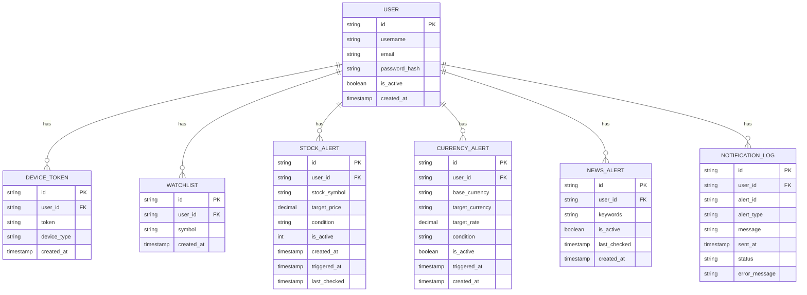

# Oracle Database Schema Documentation

## Entity Relationship Diagram (ERD)



## 테이블 스키마 상세

### 1. USER 테이블
사용자 관리 및 인증을 위한 기본 테이블

```sql
CREATE TABLE "USER" (
    id VARCHAR2(36) PRIMARY KEY,
    username VARCHAR2(50) UNIQUE NOT NULL,
    email VARCHAR2(100) UNIQUE NOT NULL,
    password_hash VARCHAR2(100) NOT NULL,
    is_active NUMBER(1) DEFAULT 1,
    created_at TIMESTAMP DEFAULT CURRENT_TIMESTAMP
);
```

### 2. DEVICE_TOKEN 테이블
푸시 알림을 위한 디바이스 토큰 저장

```sql
CREATE TABLE DEVICE_TOKEN (
    id VARCHAR2(36) PRIMARY KEY,
    user_id VARCHAR2(36) NOT NULL,
    token VARCHAR2(200) NOT NULL,
    device_type VARCHAR2(20),
    created_at TIMESTAMP DEFAULT CURRENT_TIMESTAMP,
    FOREIGN KEY (user_id) REFERENCES "USER"(id)
);
```

### 3. WATCHLIST 테이블
사용자의 관심 종목 목록

```sql
CREATE TABLE WATCHLIST (
    id VARCHAR2(36) PRIMARY KEY,
    user_id VARCHAR2(36) NOT NULL,
    symbol VARCHAR2(20) NOT NULL,
    created_at TIMESTAMP DEFAULT CURRENT_TIMESTAMP,
    FOREIGN KEY (user_id) REFERENCES "USER"(id)
);
```

### 4. STOCK_ALERT 테이블
주식 가격 알림 설정

```sql
CREATE TABLE STOCK_ALERT (
    id VARCHAR2(36) PRIMARY KEY,
    user_id VARCHAR2(36) NOT NULL,
    stock_symbol VARCHAR2(20) NOT NULL,
    target_price NUMBER(10,2) NOT NULL,
    condition VARCHAR2(10) NOT NULL,
    is_active NUMBER(1) DEFAULT 1,
    created_at TIMESTAMP DEFAULT CURRENT_TIMESTAMP,
    triggered_at TIMESTAMP,
    last_checked TIMESTAMP,
    FOREIGN KEY (user_id) REFERENCES "USER"(id)
);
```

### 5. CURRENCY_ALERT 테이블
환율 알림 설정

```sql
CREATE TABLE CURRENCY_ALERT (
    id VARCHAR2(36) PRIMARY KEY,
    user_id VARCHAR2(36) NOT NULL,
    base_currency VARCHAR2(3) NOT NULL,
    target_currency VARCHAR2(3) NOT NULL,
    target_rate NUMBER(10,4) NOT NULL,
    condition VARCHAR2(10) NOT NULL,
    is_active NUMBER(1) DEFAULT 1,
    triggered_at TIMESTAMP,
    created_at TIMESTAMP DEFAULT CURRENT_TIMESTAMP,
    FOREIGN KEY (user_id) REFERENCES "USER"(id)
);
```

### 6. NEWS_ALERT 테이블
뉴스 키워드 알림 설정

```sql
CREATE TABLE NEWS_ALERT (
    id VARCHAR2(36) PRIMARY KEY,
    user_id VARCHAR2(36) NOT NULL,
    keywords VARCHAR2(200) NOT NULL,
    is_active NUMBER(1) DEFAULT 1,
    last_checked TIMESTAMP,
    created_at TIMESTAMP DEFAULT CURRENT_TIMESTAMP,
    FOREIGN KEY (user_id) REFERENCES "USER"(id)
);
```

### 7. NOTIFICATION_LOG 테이블
알림 발송 이력 관리

```sql
CREATE TABLE NOTIFICATION_LOG (
    id VARCHAR2(36) PRIMARY KEY,
    user_id VARCHAR2(36) NOT NULL,
    alert_id VARCHAR2(36) NOT NULL,
    alert_type VARCHAR2(20) NOT NULL,
    message VARCHAR2(500) NOT NULL,
    sent_at TIMESTAMP DEFAULT CURRENT_TIMESTAMP,
    status VARCHAR2(20) NOT NULL,
    error_message VARCHAR2(500),
    FOREIGN KEY (user_id) REFERENCES "USER"(id)
);
```

## 주요 쿼리 예시

### 1. 사용자 관련 쿼리

```sql
-- 사용자 생성
INSERT INTO "USER" (id, username, email, password_hash) 
VALUES (:id, :username, :email, :password_hash);

-- 사용자 인증
SELECT * FROM "USER" 
WHERE username = :username AND is_active = 1;

-- 디바이스 토큰 등록
INSERT INTO DEVICE_TOKEN (id, user_id, token, device_type) 
VALUES (:id, :user_id, :token, :device_type);
```

### 2. 알림 관련 쿼리

```sql
-- 활성화된 주식 알림 조회
SELECT * FROM STOCK_ALERT 
WHERE is_active = 1 AND user_id = :user_id;

-- 환율 알림 생성
INSERT INTO CURRENCY_ALERT (id, user_id, base_currency, target_currency, target_rate, condition) 
VALUES (:id, :user_id, :base_currency, :target_currency, :target_rate, :condition);

-- 뉴스 알림 업데이트
UPDATE NEWS_ALERT 
SET last_checked = CURRENT_TIMESTAMP 
WHERE id = :alert_id;
```

### 3. 알림 로그 관련 쿼리

```sql
-- 알림 로그 기록
INSERT INTO NOTIFICATION_LOG (id, user_id, alert_id, alert_type, message, status) 
VALUES (:id, :user_id, :alert_id, :alert_type, :message, :status);

-- 사용자별 알림 이력 조회
SELECT * FROM NOTIFICATION_LOG 
WHERE user_id = :user_id 
ORDER BY sent_at DESC;
```

## 데이터베이스 관리 주의사항

1. ID 필드
   - 모든 테이블의 ID는 UUID v4 형식 사용
   - VARCHAR2(36) 타입으로 저장

2. 타임스탬프
   - 모든 시간 관련 필드는 TIMESTAMP 타입 사용
   - created_at은 기본값으로 CURRENT_TIMESTAMP 사용

3. 외래 키 관계
   - 모든 테이블은 USER 테이블을 참조
   - CASCADE 옵션은 사용하지 않음 (데이터 정합성 수동 관리)

4. 인덱스 관리
   - 사용자 이메일, 사용자명에 대한 유니크 인덱스
   - 외래 키에 대한 인덱스 자동 생성

5. 데이터 타입
   - 숫자형: NUMBER 사용
   - 문자형: VARCHAR2 사용
   - 불리언: NUMBER(1) 사용 (0, 1) 